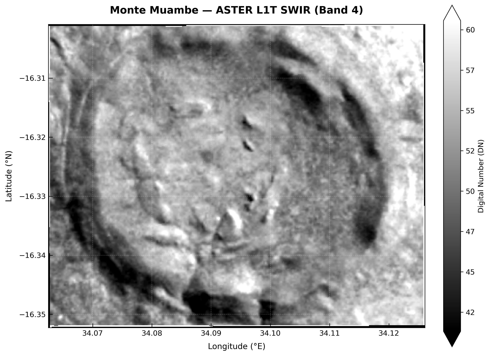
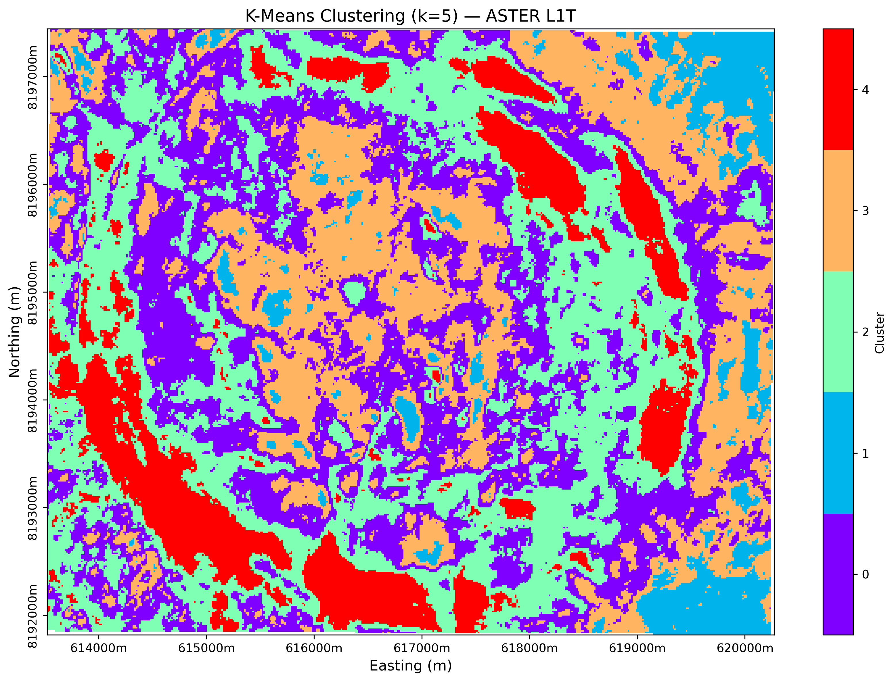
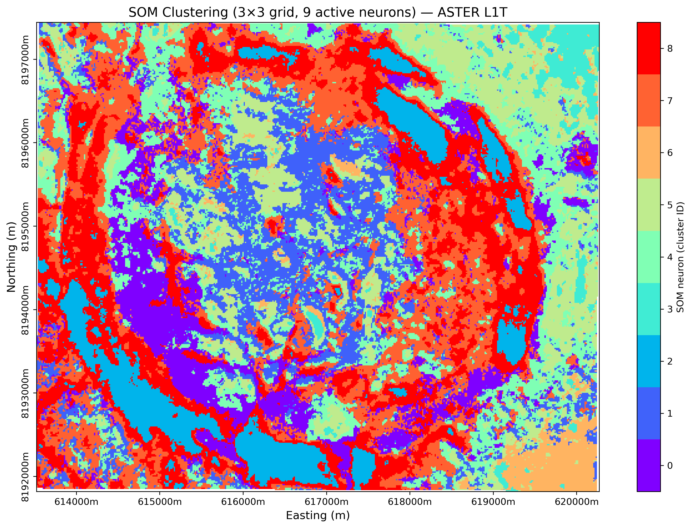

# Monte Muambe — Geological Mapping via Remote Sensing & Unsupervised Machine Learning

> **Unsupervised spectral mapping of the Monte Muambe alkaline-carbonatite complex (Tete Province, Mozambique) using ASTER L1T multispectral imagery, dimensionality reduction, and clustering algorithms.**

---

## Overview

This repository implements an **unsupervised machine learning pipeline for geological mapping** of the Monte Muambe inselberg, located in Tete Province, Mozambique (~16.3°S, 34.1°E).

The workflow adapts and extends the framework of Nagar et al. (2024) — originally developed for the Mutawintji region (Australia) — to a geologically distinct and under-characterised alkaline-carbonatite system in sub-equatorial Africa.

Monte Muambe is of particular interest due to its association with **alkaline intrusions and critical mineral enrichment**, making it a valuable target for remote sensing-based lithological discrimination.

The objective is to extract the **spectral-geological fingerprint of the intrusion** from ASTER multispectral imagery using fully unsupervised methods.

---

## Study Area

| Parameter | Value |
|-----------|------|
| Location | Tete Province, Mozambique |
| AOI (SW corner) | 16.352°S, 34.063°E |
| AOI (NE corner) | 16.301°S, 34.126°E |
| Approx. extent | ~7 km × 6 km |
| CRS | EPSG:32736 (WGS 84 / UTM Zone 36S) |
| Sensor | ASTER L1T (Terra platform) |

---

## Data

The dataset consists of **ASTER L1T (Advanced Spaceborne Thermal Emission and Reflection Radiometer)** imagery downloaded from NASA EOSDIS Earthdata.

### Spectral configuration

| Subsystem | Bands | Resolution |
|------------|------|------------|
| VNIR | B01–B03N | 15 m |
| SWIR | B04–B09 | 30 m |
| TIR | Not used | — |

All bands are:
- Reprojected to EPSG:32736
- Resampled to a common **15 m grid**
- Stacked into a single **9-band geospatial datacube**

---

### Example Input Scene

<p align="center">
  
</p>

<p align="center"><i>Figure 1: ASTER SWIR band (B04) over Monte Muambe showing lithological contrast and structural boundaries.</i></p>

---

## Methodology

The pipeline consists of four main stages implemented in `Li_Mapping_with_SOM_PCA.ipynb`.

---

### 1. Preprocessing

The preprocessing module (`aster_preprocess`) performs:

- Loading of individual ASTER GeoTIFF bands  
- Reprojection to **EPSG:32736** (correcting orbital distortion)  
- Spatial clipping to the AOI  
- Resampling to a uniform **15 m grid (bilinear interpolation)**  
- Stacking into a single 9-band analysis-ready datacube  

Output: georeferenced multispectral raster (9, Y, X)

---

### 2. Dimensionality Reduction

Two complementary approaches are applied:

#### Principal Component Analysis (PCA)

A linear dimensionality reduction method retaining ≥95% variance.

For this AOI:
- PC1: 76.8%
- PC2: 10.2%
- PC3: 7.7%
- PC4: 2.3%
- **Total explained variance: 96.9%**

PCA provides a **global linear spectral compression** of ASTER reflectance space.

---

#### Self-Organising Maps (SOM)

A non-linear topology-preserving neural mapping is used to project the 9-dimensional spectral space into a structured 2D representation.

Key properties:
- Captures **non-linear spectral manifolds**
- Preserves **topological relationships between pixels**
- Implemented via custom PyTorch-based `SOMTabular` class
- Alternative backend: `MiniSom`

Configuration:
- Grid size: 3 × 3 neurons
- Total neurons: 9

---

### 3. Clustering (K-Means)

K-Means is applied to the reduced feature space (PCA and SOM embeddings) to derive discrete lithological units.

#### Model selection

Optimal number of clusters (*k*) is determined using:

- Elbow method (inertia)
- Calinski–Harabasz index
- Davies–Bouldin index
- Silhouette score (for small k exploration)

#### Final configuration

- **k = 5**

---

### 4. Spatial Post-processing

A **7 × 7 majority filter** is applied to reduce pixel noise and improve geological coherence.

This step:
- Removes salt-and-pepper artefacts
- Enhances spatial continuity
- Produces geologically interpretable unit boundaries

---

## Results

---

### K-Means Geological Mapping (k = 5)

<p align="center">
  
</p>

<p align="center"><i>Figure 2: K-Means clustering result after majority filtering (k = 5).</i></p>

The resulting classification reveals **five distinct spectral-geological units**.

The spatial geometry suggests a **concentric ring structure**, consistent with alkaline-carbonatite intrusion systems:

- Central core (high reflectance / altered zone)
- Intermediate annular lithological units
- Peripheral regolith and weathered cover

#### Cluster validation metrics
- Calinski–Harabasz score: 111,701  
- Davies–Bouldin score: 1.21  

---

### SOM Spectral Mapping (3 × 3)

<p align="center">
  
</p>

<p align="center"><i>Figure 3: SOM neuron-based spectral clustering (9 units).</i></p>

The SOM reveals **continuous spectral transitions** not captured by K-Means.

Key observations:
- Clear radial spectral gradient from core to margin
- Distinct annular transition zone (neurons 7–8)
- Inner homogeneous spectral domain (neurons 0–1)

These patterns suggest **progressive mineralogical or weathering gradients** within the intrusion.

---

## Spectral Interpretation

Endmember spectra are extracted from SOM neuron weights in the SWIR region (1.65–2.40 µm).

These signatures can be compared against:
- USGS Spectral Library
- ASTER Spectral Library

to support:
- Mineral identification
- Lithological classification
- Hydrothermal alteration mapping

---

## Repository Structure

```text
.
├── Li_Mapping_with_SOM_PCA.ipynb   # Main pipeline (preprocessing → PCA → SOM → K-Means)
├── Datasets/
│   └── AST_L1T/                    # Raw ASTER L1T bands (not tracked)
├── output/
│   ├── ASTER_datacube_reproj_clipped.tif
│   ├── aster_kmeans_raw.png
│   ├── aster_som_map_raw.png
│   └── aster_som_spectral_curves.png
└── README.md